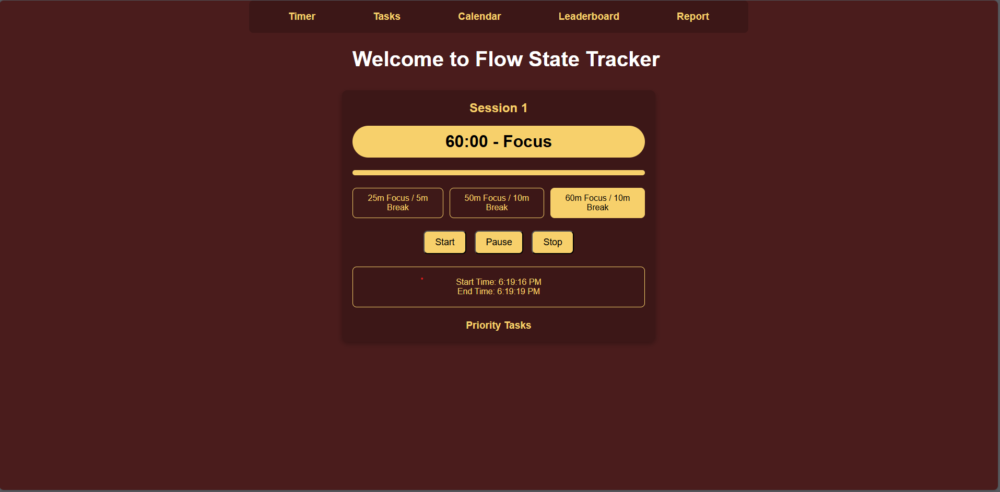

# Contribution

Please see the wiki for guidelines.

# Introduction

# Flowcus - Flow State Tracker ⏱️

A minimal and modern productivity app designed to help users manage their focus sessions using proven Pomodoro-style techniques.

## 🚀 Project Status

This is the very first version of the app. Currently, the **Timer page** is live with basic functionality. More features like task tracking, calendar, leaderboard, and reports will be added in future updates.

Live Preview: [https://advanced-flow-state-tracker.pages.dev/](https://advanced-flow-state-tracker.pages.dev/)

## 📦 Features (Initial Version)

- Pomodoro-style timer options (25/5, 50/10, 60/10)
- Start, pause, and stop timer controls
- Start and end time tracking
- Progress bar visualization
- Simple priority task section
- Basic modern design (without TailwindCSS)
- Fixed navigation header (Timer, Tasks, Calendar, Leaderboard, Report)
## image

## 🛠 Tech Stack

- React (Frontend)
- CSS (custom styling, no Tail)

